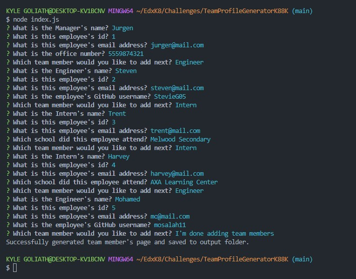
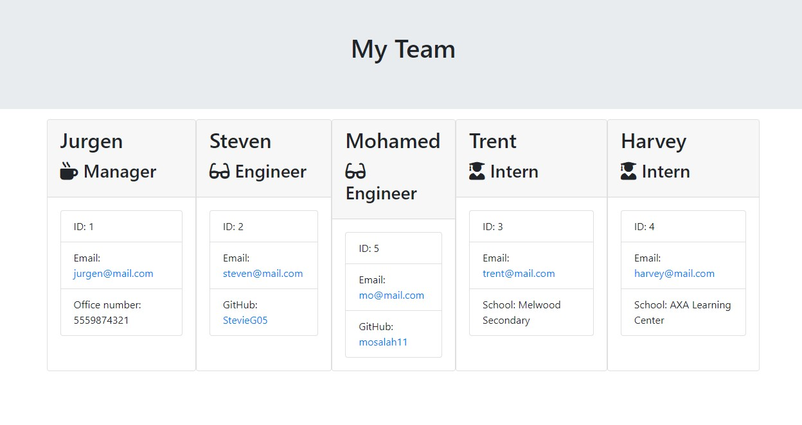

# Module 12 Object-Oriented Programming: TeamProfileGeneratorK88K 

## User Story

As a manager a user want to generate a webpage that displays my team's basic info so that a user have quick access to their emails and GitHub profiles.

## Instructions

* Create a command-line application that accepts accepts user input using the provided starter code.   
  * Create classes for each team member provided and export them. The tests for these classes (in the `_tests_` directory) must ALL pass.     
    * The first class is an `Employee` parent class with the following properties and methods:       
      * `name`
      * `id`
      * `email`
      * `getName()`
      * `getId()`
      * `getEmail()`
      * `getRole()`&mdash;returns `'Employee'`     
    * The other three classes will extend `Employee`.      
    * In addition to `Employee`'s properties and methods, `Manager` will also have the following:
      * `officeNumber`
      * `getOfficeNumber()`
      * `getRole()`&mdash;overridden to return `'Manager'`
    * In addition to `Employee`'s properties and methods, `Engineer` will also have the following:
      * `github`&mdash;GitHub username
      * `getGithub()`
      * `getRole()`&mdash;overridden to return `'Engineer'`
    * In addition to `Employee`'s properties and methods, `Intern` will also have the following:
      * `school`
      * `getSchool()`
      * `getRole()`&mdash;overridden to return `'Intern'`
    * Finally, although it’s not a requirement, consider adding validation to ensure that user input is in the proper format.   
  * Write code in `index.js` that uses inquirer to gather information about the development team members and creates objects for each team member using the correct classes as blueprints.
    * When a user starts the application then they are prompted to enter the **team manager**’s:
      * Name
      * Employee ID
      * Email address
      * Office number
    * When a user enters those requirements then the user is presented with a menu with the option to:
      * Add an engineer
      * Add an intern 
      * Finish building the team
    * When a user selects the **engineer** option then a user is prompted to enter the following and then the user is taken back to the menu:
      * Engineer's Name
      * ID
      * Email
      * GitHub username
    * When a user selects the intern option then a user is prompted to enter the following and then the user is taken back to the menu:
      * Intern’s name
      * ID
      * Email
      * School
    * When a user decides to finish building their team then they exit the application, and the HTML is generated.
  * Call the `render` function (provided for you) and pass in an array containing all employee objects; 
    * The `render` function will generate and return a block of HTML including templated divs for each employee!
  * Create an HTML file using the HTML returned from the `render` function. 
    * Write it to a file named `team.html` in the `output` folder. 
    * You can use the provided variable `outputPath` to target this location.

## Getting Started

This application uses [Jest](https://www.npmjs.com/package/jest) for running the unit tests and [Inquirer](https://www.npmjs.com/package/inquirer) for collecting input from the user. The application will be invoked by using the following command:

```bash
node index.js
```
## Results

The following images shows the results of initiating the code (node index.js) and in the collection of user information for creating a team as well as the resulting HTML output (./output/team.html):

* Terminal Questions



* Team HTML



## Resources

***Node.js***
*     https://nodejs.org/docs/latest/api/
*     https://nodejs.org/en/learn/manipulating-files/writing-files-with-nodejs
***NPMjs***
*     https://www.npmjs.com/package/inquirer#inquirerpromptquestions-answers---promise
***BabelJs***
*     https://babeljs.io/docs/
***HASHNode***
*     https://hashnode.com/post/getting-user-input-in-nodejs-using-inquirerjs-ckynrlihg05k7fms1b8677f5r
***JsPlainEnglish***
*     https://javascript.plainenglish.io/how-to-inquirer-js-c10a4e05ef1f
***LogRocket***
*     https://blog.logrocket.com/using-writefilesync-node-js/
***GeeksforGeeks***
https://www.geeksforgeeks.org/node-js-fs-writefilesync-method/
***StackOverflow***
*     https://stackoverflow.com/questions/65189877/how-can-i-validate-that-a-user-input-their-email-when-using-inquirer-npm
*     https://stackoverflow.com/questions/1344319/how-to-validate-input-using-javascript
*     https://stackoverflow.com/questions/74854450/trying-to-goto-second-inquirer-prompt-depending-on-user-selection
***jQuery***
*     https://api.jquery.com/jQuery.get/
***DigitalOcean***
*     https://www.digitalocean.com/community/tutorials/nodejs-interactive-command-line-prompts
***freeCodeCamp***
*     https://www.freecodecamp.org/news/setup-babel-in-nodejs/
***incleaf***
*     https://incleaf.github.io/babel-5-docs/docs/usage/require/


## Links 

Github Repo 

## License

Public - MIT License 
